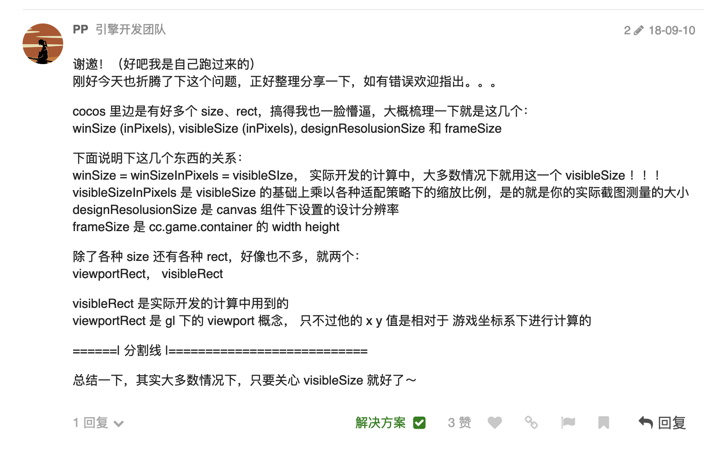
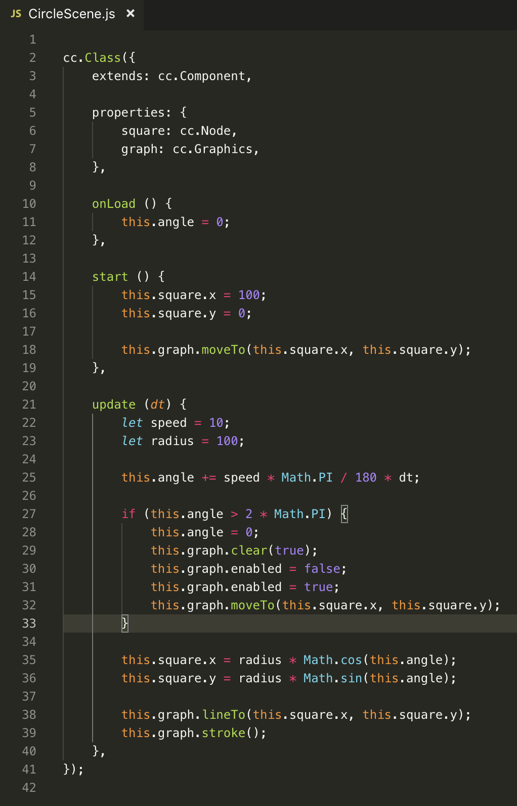
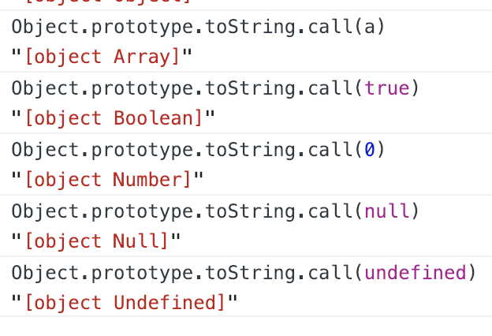
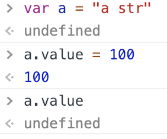
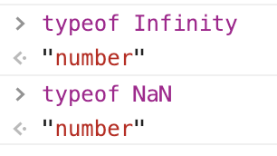
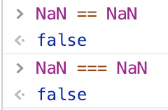
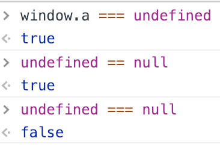
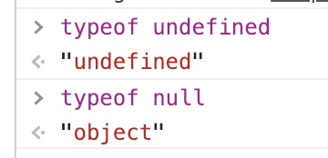
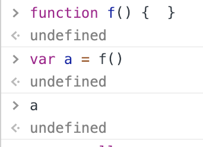
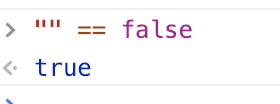

- [2019.02.21](#20190221)
- [2019.02.20](#20190220)
- [2019.02.19](#20190219)
- [2019.02.14](#20190214)
- [2019.02.12](#20190212)
- [2019.02.09, 2019.02.10](#20190209-20190210)
- [2019.02.06](#20190206)
- [2019.02.04](#20190204)
- [2019.02.03](#20190203)
- [2019.02.02](#20190202)

---

## 2019.02.21

tween, 补间动画, 缓动.



---

## 2019.02.20

原理知识
实践经验
市场标准( 业界做法 )

小游戏, 可以作为游戏的 lite 版本.

---

## 2019.02.19

游戏开发, 创造世界的能力.

gl_Position, gl_PointSize

gl_FragCoord, gl_FrontFacing, gl_PointCoord
gl_FragColor

---

## 2019.02.14

游戏感与技术能力

对于一个游戏, 游戏感比构建游戏的技术重要, 不管用什么技术, 只要达到需要的效果, 就算是基本完成了.

在完成效果的基础上, 再去研究同等效果的其他技术实现, 用新的实现方式替换原来的实现.

这样就把游戏效果和游戏技术问题分解了.


Bugly

```
绘制圆周轨迹
square, graph 是同一层级的
```




cc.Graphics 内部有自己的实现.

---

## 2019.02.12

画光:
https://zhuanlan.zhihu.com/p/30745861

计算每个像素点接受到采样方向的光

均匀采样, uniform sampling

分层采样, stratified sampling

抖动采样, jittered sampling


蒙特卡罗积分法

光线追踪

光线步进, 用 点与圆心的距离 和 半径做大小判断,

---

## 2019.02.09, 2019.02.10
```
最短路径算法.
边放松, 将已有成本与最新计算的成本作比较.

A Star 算法计算节点间距离:
F = G + H
H: 启发因子, 节点到目标点的估计距离. (欧几里得距离, 曼哈顿距离)
G: 到达节点的距离.

Dijkstra 算法(迪杰斯特拉算法) 的 H 是 0.

优先级队列, PQ
搜索边界, searchFrontier
最短路径树, shortestPathTree

openList, 开放列表, 相当于 PQ.
closeList, 关闭列表, 相当于 searchFrontier.

rhs, right hand side, 表达式的右边
```

---

## 2019.02.06

代码组织方式:

模块, 类, 函数, 语句.

语句尽量写到函数体内.

---

## 2019.02.04

洪水填充算法创建导航图

---

## 2019.02.03

```js
//返回类型字符串
Object.prototype.toString.call(o)
```

```js
//去掉开头的 [object , 和结尾的 ].
Object.prototype.toString.call(a).slice(8, -1)
```



```js
//返回对象自有属性
Object.getOwnPropertyNames(object)
Object.keys(object)
```

读取字符串, 数字, 布尔值的属性时, 创建的临时对象称作 包装对象. 临时对象只能访问一次.



NaN, 表示值为非数字.



NaN 与 自身不相等



```
原始值: undefined, null, 布尔值, 数字, 字符串.
引用类型: 数组, 对象.
原始值不可更改.
```

原型链, 作用域链

---

## 2019.02.02

```
cocos:
devicePixelRatio, 影响像素填充率.
devicePixelRatio: 3, 相当于 9 倍像素填充率.
```

```
undefined, 表示变量不存在.
null, 表示变量值为空.
```





```
函数没有返回值时, 返回的是undefined.
```




```
("" == false) 是 true
```



```
从头部取出, 并且删除头部元素
array.shift()

从尾部取出, 并且删除尾部元素
array.pop()

复制自身, 但不影响本身的元素
array.slice(0)

返回一个新的数组, 内容是array[1] 到 array[3 - 1] 的元素, 即索引从1到3, 不包括索引3.
array.slice(1, 3)

闭包: 函数对象通过作用域链相互关联, 函数变量保存在函数作用域内.
把 函数作用域链 看作 对象.

```

