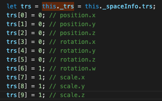

- [2020.01.04](#20200104)

---

## 2020.01.04

`trs.js`, 空间信息 与 向量, 四元数 之间的转换

空间信息:



使用四元数旋转, 需要激活 3d 坐标:

```js
node.setRotation(cc.vmath.quat.fromAxisAngle(cc.quat(), cc.v3(0,0,1), 3.1415 / 180 * 90 ))
```

向量应用矩阵变换:

`cc.vmath.vec2.transformMat4(outVec2, vec2, mat4)`

获取矩阵:

`var m = node.getLocalMatrix(cc.mat4())`

向量矩阵四元数工具函数:

cc.vmath.mat4

cc.vmath.vec3

cc.vmath.quat

