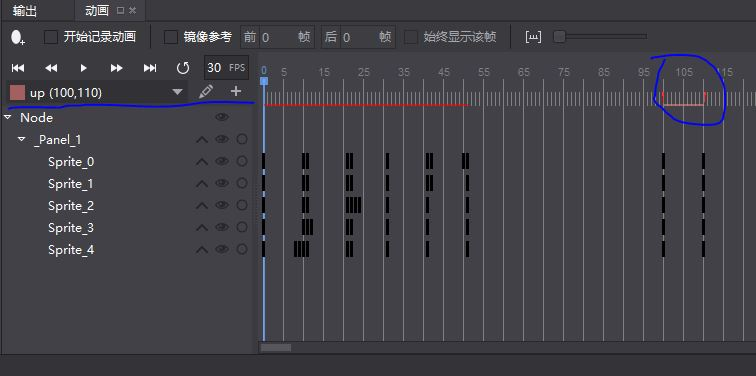

- [2019.07.11](#20190711)
- [2019.07.10](#20190710)
- [2019.07.08](#20190708)
- [2019.07.06](#20190706)
- [2019.07.05](#20190705)
- [2019.07.04](#20190704)
- [2019.07.03](#20190703)
- [2019.07.02](#20190702)
- [2019.07.01](#20190701)

---

## 2019.07.11

更新 python 包

`pip install --upgrade setuptools`

论文, https://arxiv.org/

> LuaRocks is the package manager for Lua modules.

LuaRocks, lua 包管理, https://luarocks.org/


使用 DCGAN-tensorflow:

```
python main.py --dataset=to_train --input_fname_pattern="*.png" --train --batch_size=4 --input_width=86 --input_height=85 --output_width=86 --output_height=85 --epoch=300
```


---

## 2019.07.10

获取 cocostudio v2.0 动画信息, "up" 是动画名字:

```lua
dump(actionTimeline:getAnimationInfo("up"))

"<var>" = {
    "endIndex"   = 110
    "name"       = "up"
    "startIndex" = 100
}
```



cocostudio v2.0 动画结束后, `actionTimeline:getCurrentFrame()` 不一定等于 `actionTimeline:getEndFrame()`


cocostudio button:
```lua
ccui.Button:create():addTo(parent):move(500, 100):setTitleText("play"):setTitleFontSize(30):addClickEventListener(function()
		print("_play_")
	end)
```

GAN (Generative Adversarial Nets 生成对抗网络)

Generator, 生成器

Discriminator, 鉴别器

> Generator 会根据随机数来生成有意义的数据 , Discriminator 会学习如何判断哪些是真实数据 , 哪些是生成数据, 然后将学习的经验反向传递给 Generator, 让 Generator 能根据随机数生成更像真实数据的数据.

GAN 应用, https://www.jianshu.com/p/08da013ca1cb

DCGAN-tensorflow, https://github.com/carpedm20/DCGAN-tensorflow

GAN学习指南：从原理入门到制作生成Demo, https://blog.csdn.net/heyc861221/article/details/80127914

pix2pix, https://github.com/phillipi/pix2pix


---

## 2019.07.08

使用 [GIMP 2](https://www.gimp.org/) 的橡皮擦擦除背景.

Poker:

```
A♦,2♦,3♦,4♦,5♦,6♦,7♦,8♦,9♦,10♦,J♦,Q♦,K♦,
A♣,2♣,3♣,4♣,5♣,6♣,7♣,8♣,9♣,10♣,J♣,Q♣,K♣,
A♥,2♥,3♥,4♥,5♥,6♥,7♥,8♥,9♥,10♥,J♥,Q♥,K♥,
A♠,2♠,3♠,4♠,5♠,6♠,7♠,8♠,9♠,10♠,J♠,Q♠,K♠,
1🃏,2🃏
```

```
 A♦, A♣, A♥, A♠,
 2♦, 2♣, 2♥, 2♠,
 3♦, 3♣, 3♥, 3♠,
 4♦, 4♣, 4♥, 4♠,
 5♦, 5♣, 5♥, 5♠,
 6♦, 6♣, 6♥, 6♠,
 7♦, 7♣, 7♥, 7♠,
 8♦, 8♣, 8♥, 8♠,
 9♦, 9♣, 9♥, 9♠,
10♦,10♣,10♥,10♠,
 J♦, J♣, J♥, J♠,
 Q♦, Q♣, Q♥, Q♠,
 K♦, K♣, K♥, K♠,
1🃏, 2🃏
```

---

## 2019.07.06

开发游戏, 游戏美术资源, 游戏音乐, 游戏数值, 分配给不同的人完成.

获取 cocostudio Button 里的 Sprite :

```lua
button:getVirtualRenderer():getSprite()
```

---

## 2019.07.05

循环神经网络/递归神经网络, (RNN, Recurrent Neural Networks)


判断table是否为空:

```lua
next(t) == nil
```

---

## 2019.07.04

```python
print range(5) # [0, 1, 2, 3, 4]
```

```
1e-1 = 0.1
1e-2 = 0.01
1e-3 = 0.001
```

计算积分:

```python
import scipy.integrate
def f(x,a,b):
    return ax+b;

result = scipy.integrate.quad(f,minX,maxX,args=(a_value,b_value))
```

绑定函数变量:

```python
from functools import partial

def f(x, a, b):
    return a*x+b

print f(1, 2, 2) # 2
f22 = partial(f,a=2,b=2)
print f22(1) # 2
```


- PyTorch深度学习：60分钟入门(Translation), https://zhuanlan.zhihu.com/p/25572330
- 莫烦PYTHON, 动态神经网络, https://morvanzhou.github.io/tutorials/machine-learning/torch/
- PyTorch中文网, https://www.pytorchtutorial.com/pytorch-tutorials-list/

`autograd 包`, 自动求导; `autograd.Variable`

`torch.nn 包`

`CIFAR10` 数据集


---

## 2019.07.03

导入 `help.py` 里面的所有函数

```python
from helper import *
```

---

## 2019.07.02

`lock_guard`, 可以自解锁(unlock).

```cpp
#include <mutex>

std::mutex m;
int common_value = 0;

void func()
{
    std::lock_guard<std::mutex> lockGuard(m);
    common_value = rand();
}
```

---

## 2019.07.01

protoc-gen-lua, 导出 protobuf 到 lua 的工具.

CPP_TYPE, 对应 XXX_FIELD.type

CppType,  对应 XXX_FIELD.cpp_type

```python
class CppType:
    CPPTYPE_INT32       = 1
    CPPTYPE_INT64       = 2
    CPPTYPE_UINT32      = 3
    CPPTYPE_UINT64      = 4
    CPPTYPE_DOUBLE      = 5
    CPPTYPE_FLOAT       = 6
    CPPTYPE_BOOL        = 7
    CPPTYPE_ENUM        = 8
    CPPTYPE_STRING      = 9
    CPPTYPE_MESSAGE     = 10

CPP_TYPE ={
    FDP.TYPE_DOUBLE         : CppType.CPPTYPE_DOUBLE,
    FDP.TYPE_FLOAT          : CppType.CPPTYPE_FLOAT,
    FDP.TYPE_INT64          : CppType.CPPTYPE_INT64,
    FDP.TYPE_UINT64         : CppType.CPPTYPE_UINT64,
    FDP.TYPE_INT32          : CppType.CPPTYPE_INT32,
    FDP.TYPE_FIXED64        : CppType.CPPTYPE_UINT64,
    FDP.TYPE_FIXED32        : CppType.CPPTYPE_UINT32,
    FDP.TYPE_BOOL           : CppType.CPPTYPE_BOOL,
    FDP.TYPE_STRING         : CppType.CPPTYPE_STRING,
    FDP.TYPE_MESSAGE        : CppType.CPPTYPE_MESSAGE,
    FDP.TYPE_BYTES          : CppType.CPPTYPE_STRING,
    FDP.TYPE_UINT32         : CppType.CPPTYPE_UINT32,
    FDP.TYPE_ENUM           : CppType.CPPTYPE_ENUM,
    FDP.TYPE_SFIXED32       : CppType.CPPTYPE_INT32,
    FDP.TYPE_SFIXED64       : CppType.CPPTYPE_INT64,
    FDP.TYPE_SINT32         : CppType.CPPTYPE_INT32,
    FDP.TYPE_SINT64         : CppType.CPPTYPE_INT64
}
```

