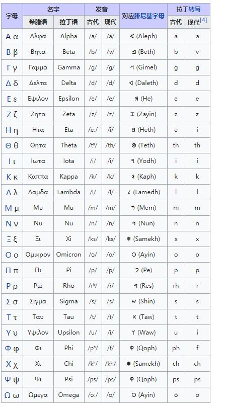

- [2019.07.26](#20190726)
- [2019.07.25](#20190725)
- [2019.07.24](#20190724)
- [2019.07.23](#20190723)
- [2019.07.22](#20190722)
- [2019.07.21](#20190721)
- [2019.07.20](#20190720)
- [2019.07.18](#20190718)
- [2019.07.16](#20190716)
- [2019.07.15](#20190715)
- [2019.07.13](#20190713)
- [2019.07.12](#20190712)
- [2019.07.11](#20190711)
- [2019.07.10](#20190710)
- [2019.07.08](#20190708)
- [2019.07.06](#20190706)
- [2019.07.05](#20190705)
- [2019.07.04](#20190704)
- [2019.07.03](#20190703)
- [2019.07.02](#20190702)
- [2019.07.01](#20190701)

---

## 2019.07.26

Synergy 同一套键鼠控制 win 和 mac.


---

## 2019.07.25

python 函数传参:

```python
def f(a="default_a", b="b", c="c"):
    print(a,b,c)

f(b=100, c=90)
```

python "计数君":

```python
from collections import Counter

c = Counter([1,2,3,4,4,4,4,3])
print(c)
print(c.most_common(2))  # 最多的两个
print(Counter(['red', 'blue', 'red', 'green', 'blue', 'blue']))

# 结果:
# Counter({4: 4, 3: 2, 1: 1, 2: 1})
# [(4, 4), (3, 2)]
# Counter({'blue': 3, 'red': 2, 'green': 1})
```

knn, k最近邻分类（nearset neighbors classification）, 判断元素与k个目标分类的距离, 选择这些距离中的最小值, 这个值对应的目标则是这个元素的分类.


`Stand-alone game`, 单机游戏

---

## 2019.07.24

更换资源的方法:

- 发现已有资源与控件的对应关系
- 更换新资源
- 发布到本地(记作 A)
- 复制 `已发布的, 最少冗余的资源` 到 目标路径(记作 B)
- 对比 A, B 路径的资源, 找出需要的新资源
- 将 A 路径的新版资源 覆盖到 B 路径
- 测试新资源

---

## 2019.07.23

`[ (input, label) ]`, 数据集的结构. 列表内的元素是数据与标签值的对应关系.

二维列表 扁平化 + 绝对值:

```python
    list_1 = [[1, -1, 2, 3], [0, 0, 9, 3], [-1, -1, -1, 6]]
    list_2 = [x if x > 0 else -x for xs in list_1 for x in xs]
    print(list_2)  # [1, 1, 2, 3, 0, 0, 9, 3, 1, 1, 1, 6]
```

---

## 2019.07.22

x raised to the power of y

x 的 y 次方

正态分布的概率累积分布函数 与 sigmoid 函数的图像相似.


---

## 2019.07.21

 python 打印文件名, 函数名, 行号 的 print 函数

```python
def _print(*content):
    depth = 1
    file_name = sys._getframe(depth).f_code.co_filename  # 文件名
    function_name = sys._getframe(depth).f_code.co_name  # 函数名
    file_line = sys._getframe(depth).f_lineno  # 行号
    print(file_name, function_name, file_line, content)

```

python 逆序:

```python
a[::-1]
```


---

## 2019.07.20

python 远程连接需要安装:

```
pip install paramiko
pip install scp
```

https://github.com/paramiko/paramiko

使用 python 复制到远程目录:

```python

from paramiko import SSHClient
from scp import SCPClient

def copyToRemote(src, dst):
	ssh = SSHClient()
	ssh.load_system_host_keys()
	ssh.connect(hostname="remote_host_name", port=22, username="user_name", password="password_text")

	with SCPClient(ssh.get_transport()) as scp:
	  scp.put(src, dst, recursive=True)

```

---

## 2019.07.18

```python
import shutil

# 复制文件
shutil.copy2('/src/file.ext', '/dst/dir')

# 复制目录
shutil.copytree(src, dst)
```

---

## 2019.07.16

```lua
-- 命名参数:

function f(x,y)
  print(x,y)
end

function f_(param)
  f(param.x,param.y)
end

f({x=1,y=2})
f {x=1,y=2}

f_({x=1,y=2})
f_{x=1,y=2} -- 可以忽略括号

--[[
table: 00e85668	nil
table: 00e858e8	nil
1	2
1	2
]]
```

---

## 2019.07.15

- [ ] 使用 cocostudio v1.6 动画
- [x] 整理 cocos 工具模块

cocostudio v2.0 导出的资源, 都通过 `cc.CSLoader:createNode(path)` 加载.

EOL, 产品寿命结束（英语：End-of-life，缩写EOL）

下载网页内容的网站, http://file2hd.com/

伯爵夫人城堡接龙, http://www.7k7k.com/swf/119467.htm

王子梦游扑克王国, http://www.7k7k.com/swf/81064.htm


---

## 2019.07.13

```
Cocos2dx Action:

Sequence(DelayTime, CallFunc)

DelayTime 的 _elapsed 属性不会变化, 变化的是 Sequence 的_elapsed .
```


---

## 2019.07.12




---

## 2019.07.11

更新 python 包

`pip install --upgrade setuptools`

论文, https://arxiv.org/

> LuaRocks is the package manager for Lua modules.

LuaRocks, lua 包管理, https://luarocks.org/


使用 DCGAN-tensorflow:

```
python main.py --dataset=to_train --input_fname_pattern="*.png" --train --batch_size=4 --input_width=86 --input_height=85 --output_width=86 --output_height=85 --epoch=300
```


---

## 2019.07.10

获取 cocostudio v2.0 动画信息, "up" 是动画名字:

```lua
dump(actionTimeline:getAnimationInfo("up"))

"<var>" = {
    "endIndex"   = 110
    "name"       = "up"
    "startIndex" = 100
}
```


cocostudio v2.0 动画结束后, `actionTimeline:getCurrentFrame()` 不一定等于 `actionTimeline:getEndFrame()`


cocostudio button:
```lua
ccui.Button:create():addTo(parent):move(500, 100):setTitleText("play"):setTitleFontSize(30):addClickEventListener(function()
		print("_play_")
	end)
```

GAN (Generative Adversarial Nets 生成对抗网络)

Generator, 生成器

Discriminator, 鉴别器

> Generator 会根据随机数来生成有意义的数据 , Discriminator 会学习如何判断哪些是真实数据 , 哪些是生成数据, 然后将学习的经验反向传递给 Generator, 让 Generator 能根据随机数生成更像真实数据的数据.

GAN 应用, https://www.jianshu.com/p/08da013ca1cb

DCGAN-tensorflow, https://github.com/carpedm20/DCGAN-tensorflow

GAN学习指南：从原理入门到制作生成Demo, https://blog.csdn.net/heyc861221/article/details/80127914

pix2pix, https://github.com/phillipi/pix2pix


---

## 2019.07.08

使用 [GIMP 2](https://www.gimp.org/) 的橡皮擦擦除背景.

Poker:

```
A♦,2♦,3♦,4♦,5♦,6♦,7♦,8♦,9♦,10♦,J♦,Q♦,K♦,
A♣,2♣,3♣,4♣,5♣,6♣,7♣,8♣,9♣,10♣,J♣,Q♣,K♣,
A♥,2♥,3♥,4♥,5♥,6♥,7♥,8♥,9♥,10♥,J♥,Q♥,K♥,
A♠,2♠,3♠,4♠,5♠,6♠,7♠,8♠,9♠,10♠,J♠,Q♠,K♠,
1🃏,2🃏
```

```
 A♦, A♣, A♥, A♠,
 2♦, 2♣, 2♥, 2♠,
 3♦, 3♣, 3♥, 3♠,
 4♦, 4♣, 4♥, 4♠,
 5♦, 5♣, 5♥, 5♠,
 6♦, 6♣, 6♥, 6♠,
 7♦, 7♣, 7♥, 7♠,
 8♦, 8♣, 8♥, 8♠,
 9♦, 9♣, 9♥, 9♠,
10♦,10♣,10♥,10♠,
 J♦, J♣, J♥, J♠,
 Q♦, Q♣, Q♥, Q♠,
 K♦, K♣, K♥, K♠,
1🃏, 2🃏
```

---

## 2019.07.06

开发游戏, 游戏美术资源, 游戏音乐, 游戏数值, 分配给不同的人完成.

获取 cocostudio Button 里的 Sprite :

```lua
button:getVirtualRenderer():getSprite()
```

---

## 2019.07.05

循环神经网络/递归神经网络, (RNN, Recurrent Neural Networks)


判断table是否为空:

```lua
next(t) == nil
```

---

## 2019.07.04

```python
print range(5) # [0, 1, 2, 3, 4]
```

```
1e-1 = 0.1
1e-2 = 0.01
1e-3 = 0.001
```

计算积分:

```python
import scipy.integrate
def f(x,a,b):
    return ax+b;

result = scipy.integrate.quad(f,minX,maxX,args=(a_value,b_value))
```

绑定函数变量:

```python
from functools import partial

def f(x, a, b):
    return a*x+b

print f(1, 2, 2) # 2
f22 = partial(f,a=2,b=2)
print f22(1) # 2
```


- PyTorch深度学习：60分钟入门(Translation), https://zhuanlan.zhihu.com/p/25572330
- 莫烦PYTHON, 动态神经网络, https://morvanzhou.github.io/tutorials/machine-learning/torch/
- PyTorch中文网, https://www.pytorchtutorial.com/pytorch-tutorials-list/

`autograd 包`, 自动求导; `autograd.Variable`

`torch.nn 包`

`CIFAR10` 数据集


---

## 2019.07.03

导入 `help.py` 里面的所有函数

```python
from helper import *
```

---

## 2019.07.02

`lock_guard`, 可以自解锁(unlock).

```cpp
#include <mutex>

std::mutex m;
int common_value = 0;

void func()
{
    std::lock_guard<std::mutex> lockGuard(m);
    common_value = rand();
}
```

---

## 2019.07.01

protoc-gen-lua, 导出 protobuf 到 lua 的工具.

CPP_TYPE, 对应 XXX_FIELD.type

CppType,  对应 XXX_FIELD.cpp_type

```python
class CppType:
    CPPTYPE_INT32       = 1
    CPPTYPE_INT64       = 2
    CPPTYPE_UINT32      = 3
    CPPTYPE_UINT64      = 4
    CPPTYPE_DOUBLE      = 5
    CPPTYPE_FLOAT       = 6
    CPPTYPE_BOOL        = 7
    CPPTYPE_ENUM        = 8
    CPPTYPE_STRING      = 9
    CPPTYPE_MESSAGE     = 10

CPP_TYPE ={
    FDP.TYPE_DOUBLE         : CppType.CPPTYPE_DOUBLE,
    FDP.TYPE_FLOAT          : CppType.CPPTYPE_FLOAT,
    FDP.TYPE_INT64          : CppType.CPPTYPE_INT64,
    FDP.TYPE_UINT64         : CppType.CPPTYPE_UINT64,
    FDP.TYPE_INT32          : CppType.CPPTYPE_INT32,
    FDP.TYPE_FIXED64        : CppType.CPPTYPE_UINT64,
    FDP.TYPE_FIXED32        : CppType.CPPTYPE_UINT32,
    FDP.TYPE_BOOL           : CppType.CPPTYPE_BOOL,
    FDP.TYPE_STRING         : CppType.CPPTYPE_STRING,
    FDP.TYPE_MESSAGE        : CppType.CPPTYPE_MESSAGE,
    FDP.TYPE_BYTES          : CppType.CPPTYPE_STRING,
    FDP.TYPE_UINT32         : CppType.CPPTYPE_UINT32,
    FDP.TYPE_ENUM           : CppType.CPPTYPE_ENUM,
    FDP.TYPE_SFIXED32       : CppType.CPPTYPE_INT32,
    FDP.TYPE_SFIXED64       : CppType.CPPTYPE_INT64,
    FDP.TYPE_SINT32         : CppType.CPPTYPE_INT32,
    FDP.TYPE_SINT64         : CppType.CPPTYPE_INT64
}
```

