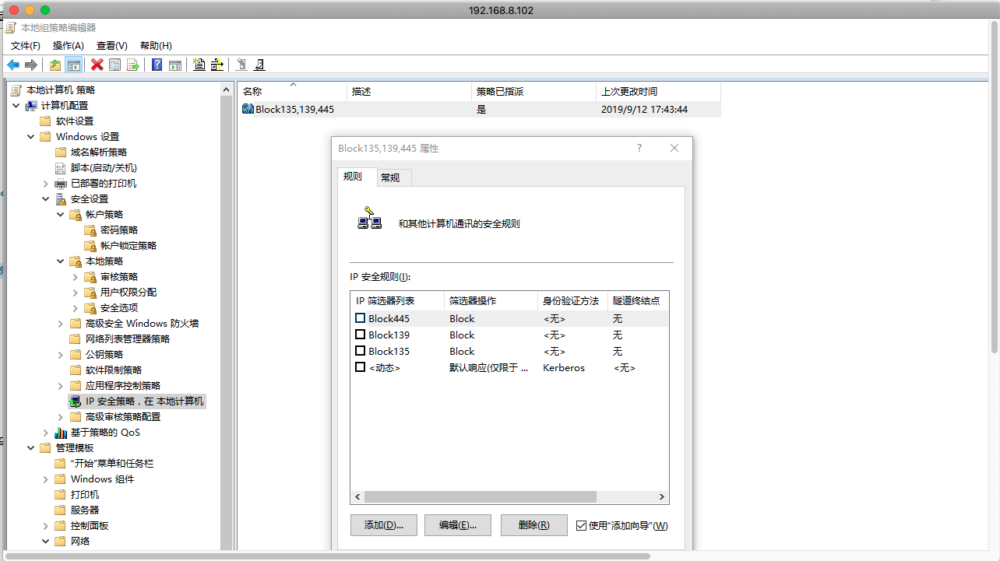

- [2019.09.18](#20190918)
- [2019.09.17](#20190917)
- [2019.09.16](#20190916)
- [2019.09.15](#20190915)
- [2019.09.14](#20190914)
- [2019.09.13](#20190913)
- [2019.09.12](#20190912)
- [2019.09.11](#20190911)
- [2019.09.10](#20190910)
- [2019.09.09](#20190909)
- [2019.09.08](#20190908)
- [2019.09.07](#20190907)
- [2019.09.06](#20190906)
- [2019.09.05](#20190905)
- [2019.09.04](#20190904)
- [2019.09.03](#20190903)
- [2019.09.02](#20190902)

---

## 2019.09.18

Flow Editor:

- load `ActType.lua`, get node types and properties
- load edge types and properties
- new or read flow file
- create node by type
- input node's property
- move node in flow graph
- connect nodes with edges
- edit edge
- save flow to file

---

## 2019.09.17

工具是为了提高生产力而存在的.


---

## 2019.09.16

一个 lisp 教程:
- https://riptutorial.com/common-lisp/topic/534/getting-started-with-common-lisp

lisp 的输出函数: `print`

`cons` 的两个参数表示, `car`, `cdr`. (Cons 对象内含有 car 指针和 cdr指针)

> 所有不是 Cons 对象的东西，就是一个原子 (atom)

判断 atom 类型:

```lisp
(atom nil) ; T
(atom 'a) ; T
(atom (list 1 2 3)) ; NIL
```

`eql`, 判断对象是否相等

`equal`, 判断内容是否相等

`copy-list`, 复制列表

`append`, 串接列表

```lisp
(append '(a b c) '(10) '(99))
; (A B C 10 99)
```

游程编码(run-length encoding), 将相连重复出现的元素合并, 并用数字表示重复次数.

```lisp
; 返回列表的第一个元素
(nth 0 '(a b c))
; A

; 第2个cdr操作
(nthcdr 2 '(a b c d e f))
; (C D E F)

; 最后一个 Cons对象
(last '(1 (a b)))
; ((A B))
```

> 函数 first 直到 tenth 可以取得列表对应的元素

映射函数: `mapcar`, `maplist`

将 Cons对象看作二叉树.

```lisp
; 替换表达式中的 x
(subst 'y 'x '(and (integerp x) (zerop (mod x 2))))
; (AND (INTEGERP Y) (ZEROP (MOD Y 2)))
```

判断递归函数是否有效:
- 基本用例(base case):确认问题规模为 1 时, 是否有解;
- 当问题规模为 n 有解时, 确认 n+1 规模是否有解;

```lisp
; member 返回匹配的元素和它之后的元素组成的列表
(member 'b '(a b c))
; (B C)

; 比较函数
(member '(z) '((a) (z)) :test #'equal) ; ((Z))

; 比较前对每个元素使用函数
(member 'a '((a b) (c d)) :key #'car) ; ((A B) (C D))
```

`oddp`, 判断奇数

`evenp`, 判断偶数

`adjoin`, 不重复添加相同的元素到列表

```lisp
(adjoin 'b '(a b c))

; 并集
(union '(a b c) '(c b s))

; 交集
(intersection '(a b c) '(b b c))

; 差集
(set-difference '(a b c d e) '(b e))
```

`push`, `pop`


```lisp
; 点状列表
(cons 'a 'b) ; (A . B)
```

<br>

luasocket 资料:
- https://www.photoneray.com/luasocket/
- https://blog.csdn.net/h1023417614/article/details/52297408


---

## 2019.09.15

lisp 类型`t` 是所有类型的基类.

内置类型:

> fixnum 、 integer 、 rational 、 real 、 number 、 atom 和 t 类型

`typep` 判断类型:

```lisp
(typep 2 'integer)
```

`顶层`


---

## 2019.09.14

`format` 是 lisp 的输出函数, `t` 表示默认输出的位置, `~a` 表示变量输出的位置, `~%` 表示换行.

```lisp
; sbcl --script a.lisp
(defun x () 10)
(format t "~a~%" (x))
```

lisp 的引用: `'`(单引号) / `quote` 函数. 引用后面的表达式, 不对它求值. 可以理解为转义

lisp 的数据类型: 符号(symbol), 列表(list), 字符串(string), 整数(integer), ...

> lisp的程序是用列表来表示的.

lisp空列表`()` 显示为 `nil`

lisp创建列表的函数: `list`, `cons`

`car` 函数, 返回列表的第一个元素.

`cdr` 函数, 返回一个列表, 它由列表第一个元素之后的所有元素组成. 如果列表只有一个元素, 则返回`nil`.

`first` 函数, 返回第一个元素. 相似的函数: `second`, `third`, `fourth`, ...

`listp` 函数, 判断参数是否为列表. 返回 `t` 表示 true(逻辑真), 返回 `nil` 表示 false(逻辑假).

谓词, predicate, 判断真假的函数.

> 在 Common Lisp 里, 谓词的名字通常以 p 结尾.

`null` / `not` 函数, 判断是否为假

lisp 的 `if 操作符`:

```lisp
(if (listp '(a b c))
      (format t "is list") ; then
      (format t "NOT list") ; else
)
```

> 任何非 nil 的东西，在逻辑的上下文里通通被视为 真 .

`and` , 如果所有的参数计算结果都是真, 则返回最后一个结果. 如果有一个参数为假, 则停止对其他参数的求值并返回假.

`or` , 如果所有的参数计算结果都是假, 则返回假. 如果有一个参数为真, 则停止计算并返回真.

`and` 与 `or` 是宏.

`eql`, 判断两个参数是否相等.

`read`, 标准输入函数:

```lisp
(read)
```

`let` 引入局部变量, 这些变量在 `let` 的函数体内有效:

```lisp
(let ((x 1) (y 2) (z 3))
     (+ x y z))
```

`numberp`, 判断是否是数值


```lisp
; 定义全局变量:
(defparameter *g_val* 99)

; 使用:
*g_val*

; 定义全局常量:
(defconstant limit "constant___")
(format t "~a~%" limit)

; setf 赋值:
(setf xx "09876")
xx

; 一个列表赋值给 变量x :
(let ((x '(o p q)))
	(format t "1:[~a]~%" x)
	(setf (car x) 'a)  ; 修改第一个元素
	(format t "2:[~a]~%" x)
)
; 1:[(O P Q)]
; 2:[(A P Q)

; 创建了 a, c, e 三个变量:
(setf a 'b
      c 'd
      e 'f)
```


`boundp`, 判断符号是否是变量:

```lisp
(boundp 'xx)
```

> 函数式编程意味着撰写利用返回值而工作的程序，而不是修改东西。它是 Lisp 的主流范式。

`do` 迭代:

```lisp
(defun show-squares (start end)
  (do ((i start (+ i 1)))
    ((> i end) 'done)
    (format t "~A ~A~%" i (* i i))
  )
)

(show-squares 1 3)
; 1 1
; 2 4
; 3 9
; DONE


; 输出 1 到 10
(do ((i 1 (+ i 1)))
	((> i 10) 'Text_xxx_yyy 'return_value)
	(format t "~A, " i)
)
; 1, 2, 3, 4, 5, 6, 7, 8, 9, 10,
; RETURN_VALUE
```

> progn 接受任意数量的表达式，依序求值，并返回最后一个表达式的值。

`dolist`, 遍历列表

```
(dolist (obj '(1 10 100 1000))
	(format t "~A|" obj)
)
```

`function` / `#'` 操作符, 返回函数的对象.

`apply`, 需要传入一个函数, 和调用该函数的参数(最后一个参数需要是列表).

```lisp
(apply #'+ '(1 2 3))
```

`funcall`, 接受一个参数, 和调用该函数的参数, 不需要组成列表.

```lisp
(funcall #'+ 1 2 3)
```


---

## 2019.09.13

interactive lua:
- http://lua-users.org/wiki/InteractiveLua
- 一个 lua 交互环境


Q: `git pull` 报错

> LibreSSL SSL_connect: SSL_ERROR_SYSCALL in connection to github.com:443

A: git 需要设置 shadowsocks 代理

```bash
git config --global http.proxy "socks5://127.0.0.1:1086"
git config --global https.proxy "socks5://127.0.0.1:1086"
```

mac远程桌面(局域网):

在一台 mac 的设置 -> 共享 -> 屏幕共享 后, 可以在另一台mac里使用 屏幕共享.app 连接.

lisp 资料:
- ansi common lisp, https://acl.readthedocs.io/en/latest/zhCN/index.html
- Practical Common Lisp,  http://www.gigamonkeys.com/book/
- https://common-lisp.net/downloads


---

## 2019.09.12


mac下, 根据提示安装java环境后, 仍然提示未找到 JAVA_HOME, 需要这样操作:
- "No Java runtime present, requesting install"
- https://blog.csdn.net/aqiang912/article/details/50463431

修改 `~/.bash_profile` 文件:

```bash
export JAVA_HOME="/Library/Internet Plug-Ins/JavaAppletPlugin.plugin/Contents/Home"
export PATH=${JAVA_HOME}/bin:$PATH
```

生效 .bash_profile:

`source .bash_profile`

验证 java 环境:

```
$ java -version
java version "1.8.0_221"
Java(TM) SE Runtime Environment (build 1.8.0_221-b11)
Java HotSpot(TM) 64-Bit Server VM (build 25.221-b11, mixed mode)
```

<br>

win 10 开启共享失败:
- 该设备或资源未设置为接受端口"文件和打印机共享(SMB)"上的连接
- 445端口
- 用机器名访问时报80070035错误，用IP访问时报80004005错误
- https://www.zhihu.com/question/54050010/answer/495157530
- https://blog.csdn.net/poolord/article/details/79619202


`gpedit.msc`, 本地组策略编辑器

`regedit`, 注册表

```
有注册表项可以禁用服务端的SMBv1、SMBv2:

Windows Registry Editor Version 5.00

--------------------------------------------------------------------------
[HKEY_LOCAL_MACHINE\SYSTEM\CurrentControlSet\services\LanmanServer\Parameters]
"SMB1"=dword:00000000
"SMB2"=dword:00000000
--------------------------------------------------------------------------

0表示禁用，1表示启用(缺省值)。

禁用客户端的SMBv1:

sc.exe config lanmanworkstation depend= bowser/mrxsmb20/nsi
sc.exe config mrxsmb10 start= disabled

启用客户端的SMBv1:

sc.exe config lanmanworkstation depend= bowser/mrxsmb10/mrxsmb20/nsi
sc.exe config mrxsmb10 start= auto

禁用客户端的SMBv2、SMBv3:

sc.exe config lanmanworkstation depend= bowser/mrxsmb10/nsi
sc.exe config mrxsmb20 start= disabled

启用客户端的SMBv2、SMBv3:

sc.exe config lanmanworkstation depend= bowser/mrxsmb10/mrxsmb20/nsi
sc.exe config mrxsmb20 start= auto

更多细节参看:

How to enable and disable SMBv1, SMBv2, and SMBv3 in Windows and Windows Server
https://support.microsoft.com/en-us/help/2696547/how-to-enable-and-disable-smbv1-smbv2-and-smbv3-in-windows-and-windows-server
```

本次解决方案:

- 关闭防火墙
- 运行 `gpedit.msc`, 查看IP策略的配置是否有禁止445端口, 如果有, 则取消掉:




<br>

装饰器是函数(wrapper), 它的参数是函数.

partial function, 偏函数, 函数的 部分参数 被预先设定好的 新函数.

```python
import functools

def func(a,b):
    return a * 10 + b

new_func = functools.partial(func, a = 9)
print(new_func(b=9))  # 99
```

---

## 2019.09.11

`Paste JSON as Code`, JSON 转 多种语言的结构体的 vs code 插件.

table.sort 的 比较函数 返回 true, 表示 a 应该排在 b 的前面

```lua
table.sort(values, function(a, b)
    return a < b
end)
```

---

## 2019.09.10

sublime text 3 package control 设置 proxy, 以安装插件.

`/Users/xxxx/Library/Application Support/Sublime Text 3/Packages/User/Package Control.sublime-settings`:

```
{
    "http_proxy": "127.0.0.1:1087",
}
```

bridge, 通常用于两种语言之间的通讯. 就像连接两个岛的桥一样, 桥使得两个岛里的人可以互相交流.


---

## 2019.09.09

刚开始使用一种框架, 减少对API提示功能的依赖, 使用编辑器进行编码, 这样可以加深对API的记忆, 提升敲代码的速度, 理解编译过程.

如果是为了提高工作效率, 可以考虑用集成开发环境(IDE).

由数据结构驱动的程序, 称作 engine, run, core, ...

类似新手引导的功能, 有点像交互模式.

---

## 2019.09.08

数据的形式:

- 程序中的数据结构
    - 对象, 容器
    - 数值
- 序列化
    - json, xml, ...

程序逻辑操作的是数据.

想到一个点子, 名字叫《假想老师》. 老师关注每个学生的历史状况, 从而作出决策.

描述历史的结构...


---

## 2019.09.07


清理 cocos2dx 资源搜索路径:

```lua
---
--- Helper:removeSearchPath("res/game_1/Animate", "res/game_1/Animate/image")
--- Helper:removeSearchPath(unpack({"res/game_1/Animate", "res/game_1/Animate/image"}))
---
function Helper:removeSearchPath(...)
    local _debug = false
    local paths = cc.FileUtils:getInstance():getSearchPaths()
    if _debug then
        dump(paths)
    end

    local new_paths = {}
    local cache = {}
    local filter = {}
    local game_path_to_remove = {...}

    for _, target in ipairs(game_path_to_remove) do
        for _, p in ipairs(paths) do
            local start_index, end_index = string.find(p, target)
            if start_index ~= nil then
                if not filter[p] then
                    filter[p] = true

                    if _debug then
                        print("find!", p, start_index, end_index)
                    end
                end
            end
        end
    end

    for _, p in ipairs(paths) do
        if not cache[p] then
            cache[p] = true
            if not filter[p] then
                table.insert(new_paths, p)
            end
        end
    end

    cc.FileUtils:getInstance():setSearchPaths(new_paths)
    local paths = cc.FileUtils:getInstance():getSearchPaths()
    if _debug then
        print("current search path:")
        dump(paths)
    end
end
```

---

## 2019.09.06

安装 pip

```
curl https://bootstrap.pypa.io/get-pip.py -o get-pip.py
sudo python get-pip.py
```

安装 shadowsocks

`pip install shadowsocks`

shadowsocks 配置文件

```
cat /etc/shadowsocks.json

{
	"server": "192.168.43.252",
	"server_port": 9630,
	"local_port": 1080,
	"password": "fire",
	"timeout": 600,
	"method": "aes-256-cfb"
}
```

启动 shadowsocks

`sudo ssserver -c /etc/shadowsocks.json -d start`

关闭 shadowsocks

`sudo ssserver -d stop`

独立于游戏逻辑的常用功能模块:

- 对话框
- 签到
- 排行榜
- 信息展示
- 修改密码
- 设置
- 帮助
- 邮件
- 商城
- 抽奖功能

android 刷机的两个模式:

关机键 + 音量减小键, 进入 fastboot mode

关机键 + 音量增大键, 进入 recovery mode

Magisk 科普, http://www.oneplusbbs.com/thread-4077732-1-1.html

魔趣rom, https://www.mokeedev.com/

Android 四：区分刷机与root, https://www.cnblogs.com/happyliuyi/p/5166009.html


---

## 2019.09.05

查看当前ip的地区, `curl ip.gs`

WFilter(超级嗅探狗)局域网监控软件是为企业量身定做的信息监控系统.

pfctl 说明, https://www.freebsdchina.org/forum/topic_24641.html

网页版 NS2 实验平台的搭建, https://github.com/rocky-nupt/ns_web

NS3教程, https://blog.csdn.net/loloha007/article/details/8256090

https://www.computerhope.com/

android 路由
- https://www.cnblogs.com/simonshi/archive/2011/05/31/2065011.html
- https://blog.csdn.net/zhuxiaoping54532/article/details/51526304


---

## 2019.09.04

http://www.jacquesf.com/2011/04/mac-os-x-dhcp-server/

https://apple.stackovernet.com/cn/q/49684

Q:

`Router <-- USB ethernet --> MAC_GW <-- ethernet --> switch <-> internal network`

A:

```
OS X Yosemite doesn’t have support for natd binary or ipfw anymore. Instead pfctl is used.

I assume the following IP-adresses/netmasks:

Router: 192.168.0.1/24
Mac mini gateway: en0: 192.168.0.2/24 gateway 192.168.0.1 en1: 192.168.1.2/24
Internal network: 192.168.1.0/24

1. First you have to enable forwarding on your Mac computer with following commands:

sudo sysctl -w net.inet.ip.forwarding=1

2. In order to do NAT you have to create a pfctl rule. Create a file called "nat-rules" with the following content:

nat on en0 from en1 to any -> (en0)

3. Save the file and now start pfctl using the rule from the file we have created earlier:

sudo pfctl -d #disables pfctl
sudo pfctl -F all #flushes all pfctl rules
sudo pfctl -f /Path/to/file/nat-rules -e #starts pfctl and loads the rules from the nat-rules file

4. Now configure a static route on your router:

192.168.1.0/24 (the internal network) -> 192.168.0.2 (Mac mini IP-address of the external interface connected to the router)

5. Enable the DHCP-service on your Mac mini gateway:

Name: choose a name
Network Interface: en1
Starting IP address: 192.168.1.10
Ending IP address: 192.168.1.100
Subnet Netmask: 255.255.255.0
Router: 192.168.1.2
DNS: some DNS-server (e.g. 8.8.8.8)

6. Now use pfctl to add rules or get a pfctl-GUI like IceFloor or Murus to configure your firewall. Both apps should also allow you to enable NAT (step 2/3)
```


Mac设置同时访问内外网, https://www.jianshu.com/p/a9d458e97c40

```
netstat -rn    --查看路由表
route get 0.0.0.0 --获取默认路由
sudo route delete 0.0.0.0    --删除默认路由
sudo route add -net 0.0.0.0 192.168.1.1    --添加外网网关
sudo route add -net 134.0.0.0  134.81.5.254    --添加内网网关（注意这里ip地址是自己要访问内网的ip地址，如果只访问某一台，可以将134.0.0.0改成固定的IP，例如134.81.5.228）
```

Mac High Sierra 配置永久静态路由, https://blog.csdn.net/zh778/article/details/79401106
- networksetup 命令

```
networksetup -listallnetworkservices

配置路由
networksetip -setadditionalroutes "Ethernet 2" 192.168.43.0 255.255.255.0 192.168.8.63

清空已配置的路由
networksetip -setadditionalroutes "Ethernet 2"
```

`sysctl`

`pfctl`, 配置转发

socat, https://www.hi-linux.com/posts/61543.html


frp, https://github.com/fatedier/frp/blob/master/README_zh.md
- 一个内网穿透工具

frp 服务端配置, frps.ini:

```
[common]
bind_port = 7000

```

frp 客户端配置, frpc.ini:

```
[common]
server_addr = 192.168.43.245
server_port = 7000

[test_echo]
type = tcp
local_ip = 192.168.43.245
local_port = 6001
remote_port = 9001

[http_proxy]
type = tcp
remote_port = 6000
plugin = http_proxy
plugin_http_user = abc
plugin_http_passwd = abc
```

启动 frp 服务端: `./frps -c ./frps.ini`

启动 frp 客户端: `./frpc -c ./frpc.ini`


`/data/misc/wifi/hostpad.confg`, ignore_broadcast_ssid=1, 隐藏热点ssid
- https://blog.csdn.net/xzx208/article/details/79622183

<br>

python list to str:

```python
list1 = [1, 2, 3]
str1 = ''.join(str(e) for e in list1)
```


---

## 2019.09.03

mac terminal 网络命令:

```
查看路由
netstat -nr
```

---

## 2019.09.02

Flow tool:

- Flow
    - Nodes
    - Edges
    - state

- Node
  - id
  - inputs(edge id)
  - outputs(edge id)
  - type

- Edge
  - id
  - input_node_id(node id)
  - output_node_id(node id)
  - type: auto / custom
  - transfer()
  - auto_transfer(by action node ret, by node state, by flow state, by global state...)
