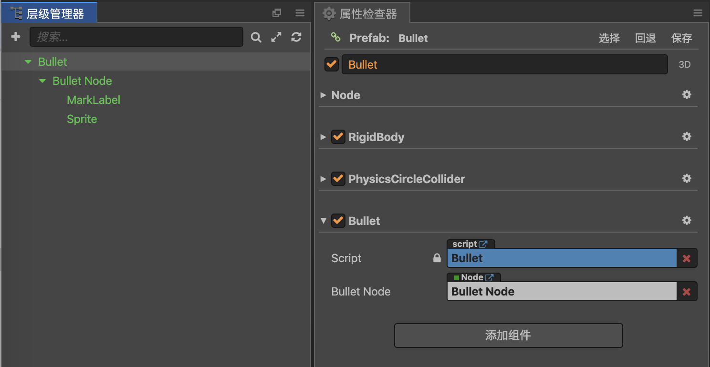

- [2019.11.12](#20191112)
- [2019.11.11](#20191111)
- [2019.11.10](#20191110)
- [2019.11.08](#20191108)
- [2019.11.07](#20191107)
- [2019.11.06](#20191106)
- [2019.11.03](#20191103)
- [2019.11.02](#20191102)
- [2019.11.01](#20191101)

---

## 2019.11.12

当刚体设定不旋转时, 可以设置子节点根据速度方向旋转.



```js
    lateUpdate(dt) {
        if (this._body && this.bulletNode) {
            const v = this._body.linearVelocity
            if (Math.abs(v.x) > 0.9 && Math.abs(v.y) > 0.9) {
                const a = v.angle(cc.Vec2.UP)
                const d = cc.misc.radiansToDegrees(a)

                // 根据速度方向, 调整贴图旋转角度
                if (v.x > 0) {
                    this.bulletNode.angle = -d
                } else {
                    this.bulletNode.angle = d
                }
            }
        }
    },
```


---

## 2019.11.11

```
日曜日是星期天
月曜日是星期一
火曜日是星期二
水曜日是星期三
木曜日是星期四
金曜日是星期五
土曜日是星期六
```

方向向量, 如果需要对它进行坐标转换, 就要先分别对 头尾坐标 进行转换, 再求转换后的方向向量.


---

## 2019.11.10

`rigidbody.getWorldRotation()` 与 `node.angle` 符号相反, 数值相等

节点系统事件, 全局系统事件

> 全局系统事件是指与节点树不相关的各种全局事件，由 cc.systemEvent 来统一派发


---

## 2019.11.08

一款开源web聊天工具, https://github.com/yinxin630/fiora


Android MediaPlayer
- https://blog.csdn.net/csdn_of_coder/article/details/63684353
- https://blog.csdn.net/john_chedan/article/details/80692427


creator 物理组件:

- torque > 0, 逆时针旋转
- torque < 0, 顺时针旋转

设置damping(衰减系数), 让刚体停下来:

`rigidbody.angularDamping = 10000`

触摸坐标转换为世界坐标:

```js
onTouchEnd(event) {
    let p = this.camera.getScreenToWorldPoint(event.getLocation())
},
```


---

## 2019.11.07

降低物理系统的更新步长(`FIXED_TIME_STEP`), 速度迭代次数(`VELOCITY_ITERATIONS`)和位置迭代次数(`POSITION_ITERATIONS`), 更可能出现刚体穿透问题.

RevoluteJoint, 旋转关节组件, 两刚体围绕共同点旋转

DistanceJoint, 距离关节组件, 两个刚体保持距离

PrismaticJoint, 棱柱关节组件, 两刚体位置间的角度固定, 只能在指定轴上滑动

WeldJoint, 焊接关节组件, 根据两刚体的初始角度, 将两个物体上的两个点绑定在一起

WheelJoint, 轮子关节组件

RopeJoint, 绳子关节组件

MotorJoint, 马达关节组件, 控制两刚体的相对运动

---

## 2019.11.06

creator 播放声音的方式:

`cc.AudioSource`

`cc.audioEngine`


---

## 2019.11.03

Blender 操作:

`shift + a`, 创建物体

`shift + c`, 回到原点

`x`, 删除

`a`, 全选

`w`, 细分骨骼

绑定网格和骨骼:

全选网格, 全选骨骼, `ctrl + p`

uv 拆分:

- 选择物体的接缝边
- `ctrl + e`, 选择 `mark seam`(标记缝合边)
- 按 `a` 选择全部面, 按 `u`, 选择 `unwrap`
- 在 uv编辑器 调整:
  - `b + MB`, 框选网格点
  - `g + RMB`, 移动网格点


---

## 2019.11.02

对于 3d 动画剪辑(animation clip), `cc.Animation` 不能同时播放多个.


---

## 2019.11.01

creator `SkinnedMeshRenderer` 组件:
- `Shadow Casting Mode` 属性, 用来开启阴影投影
- `Receive Shadows` 属性, 开启接收阴影


```js
// 多一层保护
function_1 () {
    return experimental_api()
}
```

`RMB`, `right mouse button`, 右键

